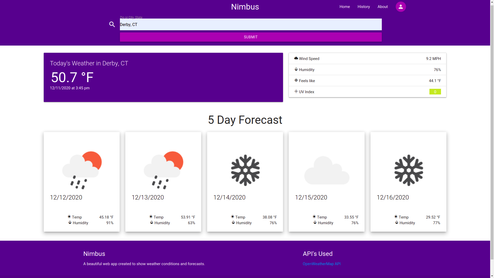

# Nimbus

## Objective
As a homework assignment, I had to build a weather app that would grab data from the OpenWeatherMap API and use that data by displaying it on screen with the relevant information required. Such as _temperature, humidity, UV index and the image for the current weather data for the day and the next 5 days._ This app also includes a search hostory!

**_Since there was no specified regions in the homework assignment, I decided to limit the apps functionality to the United States ONLY!_**

## What will come with a refactor, later.

 - International Support
 - The option to change the length of the forecast.
 - User accounts
 - Possibly a native mobile app using React.js

---

## Screenshot

The following animation demonstrates the application functionality:

---

## License
This application is licensed under the BSD 2 Clause license. [Read the License][license].

[license]: ./LICENSE.md